# Nguyễn Thế Chương
# 2224802010930


# 🌦️ Flutter Weather App

Một ứng dụng thời tiết hiện đại, đầy đủ tính năng được xây dựng bằng **Flutter**, hỗ trợ xem thời tiết theo thời gian thực, dự báo chi tiết, bản đồ radar và **Widget màn hình chính (Android)**.

## ✨ Tính năng Nổi bật

### 📱 Chức năng chính

  * **📍 Định vị tự động:** Tự động lấy thời tiết tại vị trí hiện tại (GPS).
  * **🔍 Tìm kiếm thông minh:** Tìm kiếm thành phố bất kỳ trên thế giới.
  * **🌡️ Thời tiết hiện tại:** Hiển thị Nhiệt độ, Độ ẩm, Gió, Áp suất, Tầm nhìn, Cảm giác như (Feels like).
  * **😷 Chỉ số AQI:** Cảnh báo chất lượng không khí với màu sắc trực quan (Tốt, Khá, Kém, Nguy hại...).
  * **⚠️ Cảnh báo thiên tai:** Hiển thị banner cảnh báo khi có bão, mưa lớn hoặc ô nhiễm.

### 📅 Dự báo (Forecast)

  * **Dự báo theo giờ (24h):** Biểu đồ nhiệt độ và thời tiết từng giờ.
  * **Dự báo 5 ngày:** Xem chi tiết thời tiết các ngày trong tuần (Thứ, Ngày/Tháng, Lượng mưa).

### 🗺️ Bản đồ & Radar

  * Tích hợp **OpenStreetMap** và các lớp phủ thời tiết (OpenWeatherMap Layers):
      * **Radar:** Chế độ xem radar thời tiết.
      * **Nhiệt độ:** Bản đồ nhiệt.
      * **Lượng mưa:** Bản đồ phân bố mưa (có hiệu ứng mưa rơi động).

### ⚖️ So sánh Thành phố

  * So sánh trực tiếp các chỉ số (Nhiệt độ, Độ ẩm, Gió, AQI...) giữa hai thành phố khác nhau trên cùng một màn hình.

### ⚙️ Cài đặt & Cá nhân hóa

  * **Đa ngôn ngữ:** Chuyển đổi mượt mà giữa **Tiếng Việt 🇻🇳** và **English 🇺🇸**.
  * **Đơn vị đo:** Tuỳ chọn độ C/F, tốc độ gió (m/s, km/h, mph).
  * **Định dạng giờ:** 12h hoặc 24h.
  * **Chế độ Offline:** Tự động lưu cache để xem khi không có mạng.

### 📱 Android Home Widget

  * Tiện ích màn hình chính hiển thị:
      * Thành phố & Nhiệt độ hiện tại.
      * Dự báo vắn tắt 3 khung giờ tiếp theo.
      * Tự động đồng bộ dữ liệu từ App.

-----

## 📸 Giao diện Ứng dụng (Screenshots)
* Màn hình chính 
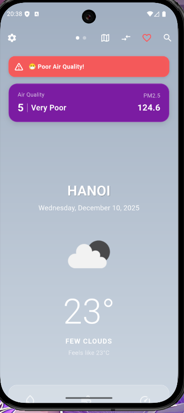
* Hiển thị thông tin thời tiết 
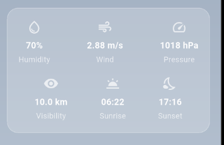
* Dự báo các giờ tiếp theo và 5 ngày sau 
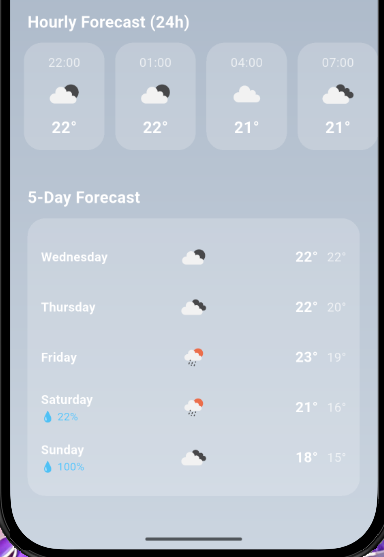
* Setting
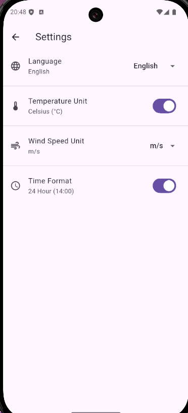
* Các loại bản đồ 
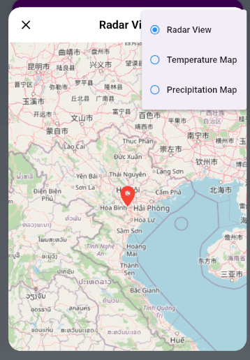

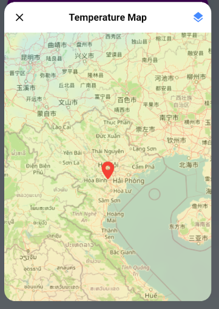

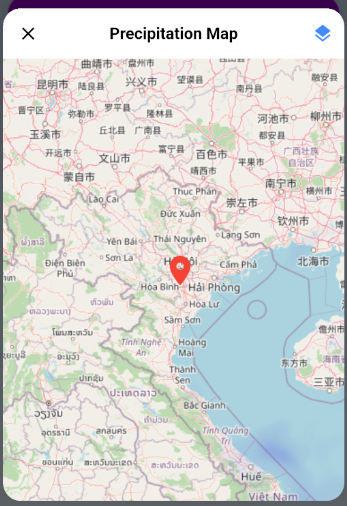
* Thành phố yêu thích 
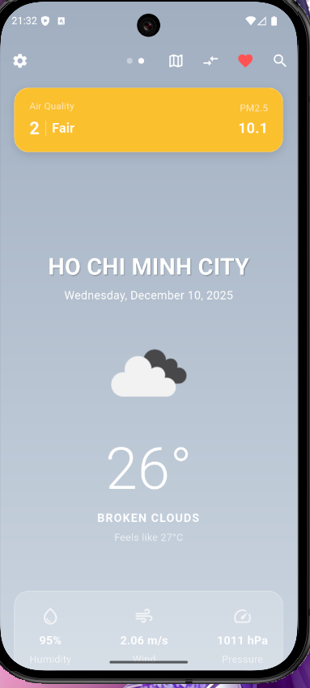

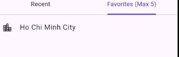
* Tìm Kiếm
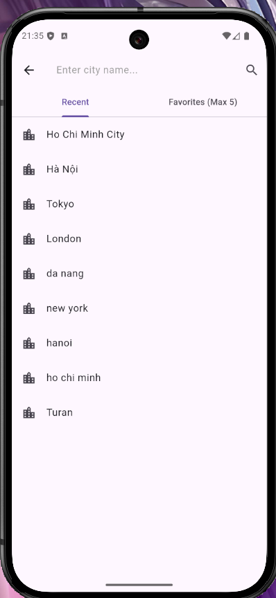
* So sánh thành phố 
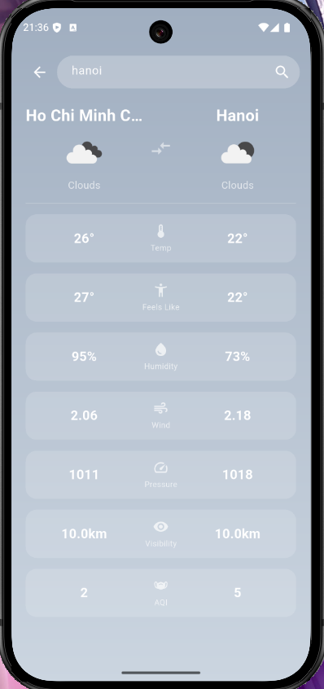
* Cảnh báo thời tiết 
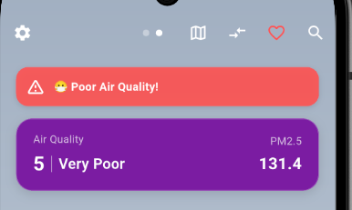
* Tiện ích 
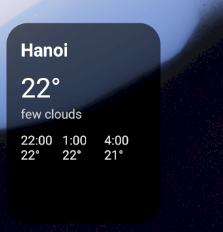

-----

## 🛠️ Công nghệ sử dụng

  * **Framework:** Flutter
  * **Ngôn ngữ:** Dart, Kotlin (cho Android Widget)
  * **State Management:** `Provider`
  * **Networking:** `http`
  * **Maps:** `flutter_map`, `latlong2`
  * **Location:** `geolocator`, `geocoding`
  * **Local Storage:** `shared_preferences` (Caching & Settings)
  * **Native Integration:** `home_widget` (Giao tiếp giữa Flutter và Android XML Layout)
  * **API:** [OpenWeatherMap API](https://openweathermap.org/)

-----

## 🚀 Cài đặt và Chạy dự án

### 1\. Yêu cầu tiên quyết

  * Flutter SDK (phiên bản ổn định mới nhất).
  * Java JDK 17 (Cấu hình trong `android/app/build.gradle`).
  * Android Studio hoặc VS Code.
  * Một API Key từ OpenWeatherMap.

### 2\. Clone dự án

```bash
git clone https://github.com/username/weather-app.git
cd weather-app
```

### 3\. Cấu hình API Key
* Tạo file .env và thêm key api vào file .env 
* (Tôi sử dụng Website: https://openweathermap.org/api)
* Nếu sử dung api khác thì hãy cấu hình apt ở file api_config

```dart
class ApiConfig {
  static const String apiKey = "YOUR_OPENWEATHERMAP_API_KEY";
}
```

### 4\. Cài đặt thư viện

```bash
flutter pub get
```

### 5\. Chạy ứng dụng

```bash
flutter run
```

-----

## 🧩 Hướng dẫn cài đặt Android Widget

Do Widget sử dụng bộ nhớ giới hạn của Android, nếu gặp lỗi không hiển thị, hãy làm theo các bước sau:

1.  Đảm bảo bạn đã chạy ứng dụng ít nhất một lần để tải dữ liệu thời tiết.
2.  Ra màn hình chính điện thoại, nhấn giữ vào khoảng trống -\> Chọn **Widgets**.
3.  Tìm **Weather App** và kéo Widget ra màn hình.
4.  Nếu Widget không cập nhật hoặc bị lỗi layout:
      * Xóa Widget cũ.
      * Chạy lệnh `flutter clean` sau đó `flutter run`.
      * Thêm lại Widget mới.

-----

## 📂 Cấu trúc thư mục

```
lib/
├── config/          # Cấu hình API Key
├── models/          # Các Model (Weather, Forecast, Hourly...)
├── providers/       # Quản lý trạng thái (WeatherProvider, LocationProvider)
├── screens/         # Các màn hình (Home, Search, Forecast, Compare, Settings)
├── services/        # Xử lý API, Storage, Connectivity
├── utils/           # Các tiện ích (Format ngày tháng, Icon, Color)
├── widgets/         # Các Widget tái sử dụng (Card, Chart, List...)
└── main.dart        # Entry point
android/
├── app/src/main/res/layout/   # XML Layout cho Widget (widget_layout.xml)
└── app/src/main/kotlin/       # Logic xử lý Widget (WeatherWidgetProvider.kt)
```

-----
